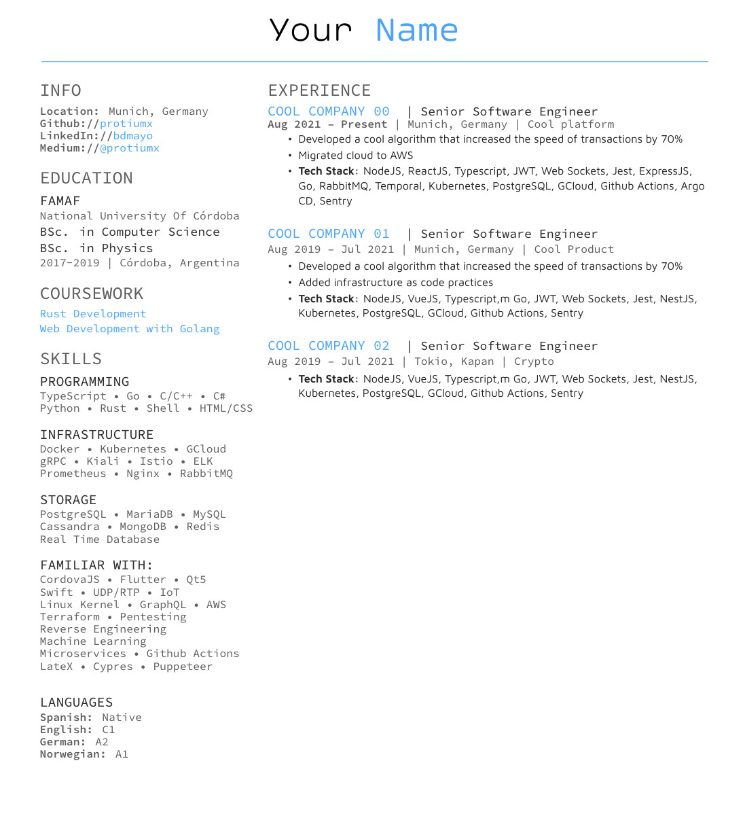

# dev.resume

Your new pretty and minimalist resume.
Based on: https://github.com/deedydas/Deedy-Resume

## Preview

## Colors

You can change any color in the [class definition](resume.cls).

- primary: `#2b2b2b`
- headings: `#6A6A6A`
- subheadings: `#333333`
- links: `#33AFFF`

## Commands

- `\namesection`: The resume header for your name. It expect to arguments: first name and last name
- `\runsubsection`: For company name
- `\location`: Location of the company

## Compiling

You need a `xelatex` compiler. I used [overleaf](https://www.overleaf.com/) to edit and compile my resume.

